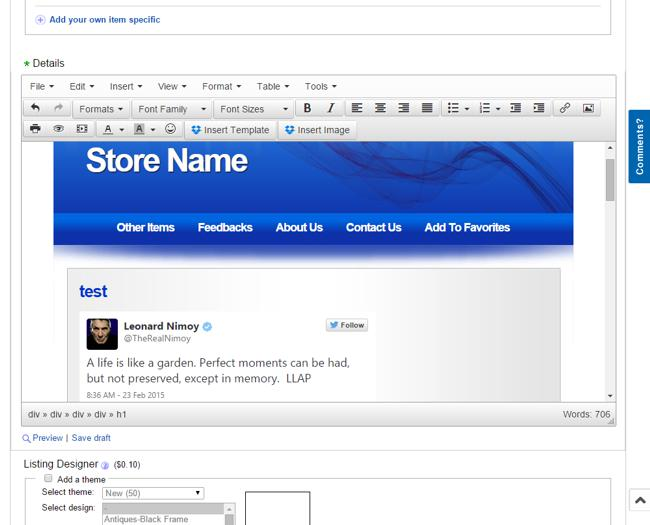

# tinymce-ebay

Javascript-Snippet to replace the very limited eBay auctioneditor with the mighty TinyMCE Editor. It's extended with Dropbox integration to insert images and load templates hostet on Dropbox. It also replaces the placeholders {title} and {subtitle} with the values from the ebay form fields on load.

### Usage 
* You need an Userscriptmanager for your Browser: 
	* [Tampermonkey for Chrome](https://chrome.google.com/webstore/detail/tampermonkey/dhdgffkkebhmkfjojejmpbldmpobfkfo?hl=de)
    * [Greasemonkey for Firefox](https://addons.mozilla.org/en-US/firefox/addon/greasemonkey/) **Doesn't working for now, see the known issues :confused:**

* Click on this link and the Scriptmanager asks you about installation: 
	* :gb: __English Version: https://rawgit.com/Netzvamp/tinymce-ebay/master/tinymce-ebay.user.js__
	* :de: German Version:  https://rawgit.com/Netzvamp/tinymce-ebay/master/tinymce-ebay.de.user.js

* Go to [ebay.com](http://www.ebay.com) or the eBay in your country and start an new auction to see the editor in action

### Known Issues / Todo
* Doesn't work with Firefox/Greasemonkey: TinyMCE gets injected but doesn't respond on any action :confused:
* Can't dynamic load different language files for TinyMCE on runtime, only one with the @require from the scriptmanager. __Cause of that i've done a seperate german version, but will work to get back to one file.__
